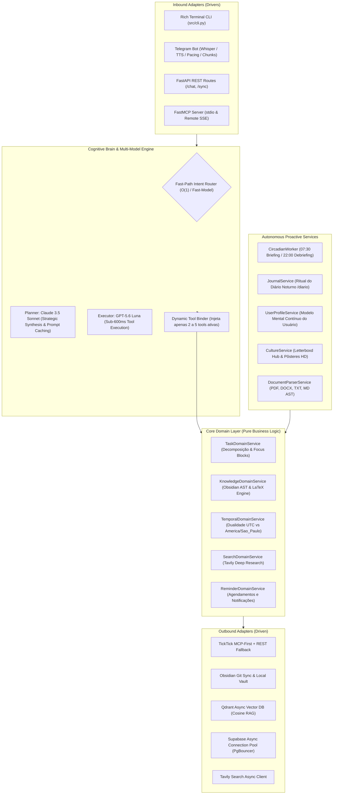

# Project Maeve: Context-Aware Autonomous Knowledge & Task Orchestrator

<p align="center">
  
  
  
  
  
  
  
  
  
  
  
</p>

---

## 📌 Visão Geral Executiva

O **Project Maeve** é um orquestrador autônomo de tarefas, gestão de conhecimento e modelo mental contínuo desenvolvido sob os princípios de **Staff Software Engineering**, **Arquitetura Limpa (Hexagonal / Ports & Adapters)** e **Model Context Protocol (MCP)**.

Diferente de chatbots reativos ou *wrappers* ingênuos de APIs, a Maeve atua como uma **camada de inteligência e execução bi-direcional (Two-Way Street)** entre o Segundo Cérebro do usuário e suas ferramentas de tração operacional:

1. **Memória Semântica Bi-Direcional (Read/Write RAG):** Conexão direta com um **Obsidian Vault** sincronizado via Git privado e vetorizado no **Qdrant**. A Maeve responde a consultas contextuais densas sobre o acervo do usuário, sintetiza novos aprendizados com rigor matemático ($\LaTeX$) e grava autonomamente novas notas e conexões.
2. **Execução Operacional de Alta Precisão:** Integração com o gerenciador de tarefas **TickTick** via protocolo nativo **MCP-First com fallback REST**, permitindo listar, criar, reagendar, decompor projetos complexos em blocos de foco (*chunking* anti-sobrecarga) e concluir tarefas.
3. **Host-Driven Zero-Token FastMCP Server:** Servidor nativo do protocolo MCP que expõe ferramentas, memória semântica e recursos em tempo real para IDEs de ponta (**Google Antigravity**, **Cursor**, **Claude Desktop**) via **stdio** (local) e **Streamable HTTP / SSE** com autenticação perimetral (nuvem).
4. **Assistência Multimodal Proativa:** Acessível via **Telegram** (transcrição de áudio com Whisper, síntese de voz natural com OpenAI TTS, ingestão de documentos `.pdf`/`.docx`), terminal interativo **Rich CLI** e rotinas circadianas autônomas em segundo plano.

---

## 🏛️ Arquitetura do Sistema (Hexagonal / Ports & Adapters)

O núcleo da Maeve adota separação estrita de responsabilidades (**SOLID / DIP / SRP**). Toda a lógica de negócios reside em uma **Camada de Domínio Pura**, completamente desacoplada de frameworks de transporte (FastAPI, LangGraph ou FastMCP), permitindo testabilidade completa em milissegundos.



---

## ⚡ Destaques de Engenharia & Inovações Técnicas

### 1. Padrão Híbrido Planner-Executor Assimétrico (-95% de Custos de Inferência)
A segregação entre raciocínio abstrato e execução atômica maximiza a precisão e reduz drasticamente os custos operacionais:
- **Planner (`claude-3-5-sonnet-20241022`):** Conduz síntese de conhecimento denso, desconstruções conceituais e arquitetura de notas complexas. Opera com **Anthropic Prompt Caching**, reduzindo em até **90%** os custos de token de entrada em conversas contínuas.
- **Executor (`gpt-5.6-luna`):** Acionado para chamadas ferramentais diretas, escrita rápida no Vault e tarefas operacionais de baixa entropia, respondendo em menos de **600ms** com custo até **25x menor** por milhão de tokens.

### 2. Intent-Based Dynamic Tool Routing (Eliminação de *Tool Bleed*)
Expor dezenas de ferramentas simultaneamente no prompt sobrecarrega a atenção do transformador ($O(N^2)$ a $O(N \log N)$), gera alucinação de parâmetros e consome milhares de tokens por turno.
- O roteador inteligente da Maeve avalia a intenção (`tasks`, `knowledge`, `search`, `reminders` ou `chat`) e **injeta dinamicamente apenas o conjunto estrito de 2 a 5 ferramentas necessárias**.
- **Resultado:** Queda de overhead de ~3.500 tokens para ~400 tokens por turno (**-88% de consumo**).

### 3. Zero-Token Host-Driven FastMCP Server
Implementação de um servidor nativo **FastMCP** (`src/mcp/server.py`) que expõe ferramentas de tarefas, memória e contexto:
- **Zero-Token Local:** Nenhuma computação generativa ocorre no backend durante o uso via MCP. O host/IDE financia a inferência; o servidor responde apenas com dados determinísticos e vetores semânticos puros (`text-embedding-3-small`).
- **Dual Transport:** Suporte a **stdio** para integração direta com IDEs locais (Cursor, Google Antigravity) e **Streamable HTTP / SSE** montado no FastAPI (`/mcp`) com autenticação perimetral via Bearer Token para acesso remoto na nuvem.

### 4. RAG com Preservação de Notação Matemática ($\LaTeX$) e AST
- Indexação semântica no **Qdrant** respeitando fronteiras sintáticas do Markdown (árvore de cabeçalhos H1/H2/H3, tabelas e blocos de código atômicos).
- **Mandato Estrito de LaTeX:** Preservação integral de notações matemáticas padrão MathJax (`$inline$` e `$$bloco$$`), garantindo consistência geométrica nos embeddings e legibilidade impecável no Obsidian.

### 5. Ingestão Multimodal Universal de Documentos
- Extração de texto de `.pdf`, `.docx`, `.txt`, `.md`, `.json`, `.csv` diretamente via Telegram.
- Fallback nativo em `xml.etree` e `zipfile` para arquivos Word, eliminando dependências externas pesadas.
- **Detecção Contextual de Perfis:** Reconhecimento automático de currículos profissionais para extração de habilidades, histórico e atualização direta da nota mestre de perfil do usuário.

### 6. Hub Cultural & Curadoria de Repertório (Letterboxd / Goodreads Engine)
- Serviço especializado (`CultureService`) para catalogação de filmes, séries, livros, jogos e animes.
- Busca automática de fichas técnicas e **pôsteres em alta definição** via **Wikipedia REST API**, **OpenLibrary** e **TMDB**.
- Geração de notas atômicas no Obsidian com sinopse, desconstrução técnica (fotografia, ritmo, subtexto moral) e atualização automática do catálogo geral acumulador.

### 7. Worker Circadiano Autônomo & Blocos de Foco Anti-Sobrecarga
- Worker assíncrono em background operando no fuso horário do usuário (`America/Sao_Paulo`):
  - **07h30 (Briefing Matinal):** Sincronização de metas acadêmicas e tarefas de alto impacto alinhadas ao pico de energia circadiana.
  - **22h00 (Debriefing Noturno):** Convite acolhedor para desaceleração e início do diário pessoal.
  - **Domingo 09h00 (Check-up Semanal):** Diagnóstico de saúde do Vault (`Inbox/`) e saneamento de backlog.
- **Anti-Bagunça Focus Blocks (`schedule_focus_blocks`):** Algoritmo que quebra grandes metas em blocos de foco contínuos de 90 a 120 minutos no TickTick, combatendo a dispersão por excesso de microtarefas.

### 8. Modelo Mental Contínuo do Usuário & Diário Noturno (`/diario`)
- Ritual noturno guiado via Telegram para consolidação de aprendizados diários, bloqueios e vitórias.
- O `UserProfileService` aprende silenciosamente com as interações, mantendo atualizada a nota `Recursos/Perfil/Perfil Pessoal e Padrões.md` no Vault e um vetor semântico no Qdrant, alimentando o contexto do agente sem inflar o prompt de sistema estático.

### 9. Resiliência de Conexões e Edge Cases em Produção
- **Supabase PgBouncer & `DuplicatePreparedStatement`:** Configuração com desativação de statements nomeados (`prepare_threshold: 0`) e autocommit isolado, eliminando conflitos clássicos de transaction pooling em nuvem.
- **Dualidade Temporal Estrita:** Backend e bancos operam estritamente em **UTC**, enquanto a interpretação semântica e exibição ao usuário operam com consciência explícita em **`America/Sao_Paulo` (UTC-3)**.
- **Pacing Conversacional e Autocura de Markdown:** Fatiamento semântico de respostas longas no Telegram em balões de 800 a 1.200 caracteres, aplicando ações de `typing`, *silent push* e algoritmo de autocura que fecha e reabre tags de formatação partidas no limite do chunk.

---

## 🛡️ Postura de Segurança & Defense-in-Depth

O projeto segue políticas rigorosas de segurança defensiva:

| Camada | Mecanismo de Defesa | Detalhes da Implementação |
| :--- | :--- | :--- |
| **Perímetro de Rede** | Autenticação por Tokens | Endpoints HTTP (`/chat`, `/sync`) e rotas MCP (`/mcp/sse`) protegidos por verificação estrita de `API_KEY` / `MAEVE_MCP_SECRET`. Bloqueio imediato em produção se as chaves não estiverem configuradas. |
| **Filesystem / Vault** | Proteção contra Path Traversal | O método `_safe_resolve` em `ObsidianService` valida rigorosamente todos os caminhos relativos, impedindo qualquer acesso ou escrita fora da raiz do Vault (`../`). |
| **Acesso ao Bot** | Whitelist Estrita de Usuários | O `TelegramService` valida o ID de cada remetente contra `TELEGRAM_ALLOWED_USER_ID`. Mensagens, áudios ou documentos de terceiros são silenciosamente descartados. |
| **Banco de Dados** | Imunidade a SQL Injection | 100% das consultas SQL no Supabase utilizam parâmetros tipados (`%s`) através do driver nativo `psycopg 3`, sem concatenação de strings. |
| **Execução de Comandos** | Subprocessos Isolados | Chamadas ao Git CLI utilizam passagem de argumentos como lista (`["git", "commit", "-m", ...]`) sem `shell=True`, eliminando riscos de injeção de comandos. |
| **Gestão de Segredos** | Zero Credenciais no Repositório | Arquivos `.env` ignorados no `.gitignore`. Auditorias automatizadas garantem que nenhuma chave privada ou segredo permaneça no histórico do Git. |

---

## 📊 Benchmarks de Eficiência e Economia

| Métrica / Cenário | Abordagem Tradicional (Monolítica) | Arquitetura Maeve (v0.4.0+) | Ganho Obtido |
| :--- | :--- | :--- | :--- |
| **Overhead de Tools por Turno** | ~3.500 tokens (22 tools no prompt) | ~400 tokens (roteamento dinâmico) | **-88% tokens** |
| **Custo de Escrita de Notas** | Claude Sonnet (~$15.00 / 1M out) | GPT-5.6 Luna (~$0.60 / 1M out) | **-96% custo** |
| **Input Cache em Diálogos Longos** | Reprocessamento total de histórico | Anthropic Prompt Caching | **-90% input cost** |
| **Latência Média de Roteamento** | 2.5s a 4.0s (chamada síncrona monolítica) | < 600ms (Fast-Path + Luna Router) | **~4.5x mais rápido** |
| **Confiabilidade de Conexão DB** | Falhas esporádicas no PgBouncer | Pool resiliente assíncrono (Psycopg 3) | **Zero crashes em produção** |

---

## 🗂️ Estrutura do Repositório

```text
context-aware-task-agent/
├── docker-compose.yml          # Orquestração do cluster local (App + Qdrant)
├── Dockerfile                  # Container multi-stage de produção Python 3.11
├── requirements.txt            # Dependências pinadas estritamente
├── AGENTS.md                   # Blueprint mestre de arquitetura e histórico de sprints
├── db/                         # Scripts de schema e segurança do PostgreSQL/Supabase
└── src/
    ├── main.py                 # FastAPI Composition Root (lifespan, routes, MCP mount)
    ├── cli.py                  # Cliente interativo Rich Terminal (CLI)
    ├── debug_tasks.py          # Utilitário de inspeção e debug do TickTick
    ├── setup_ticktick.py       # Helper de autorização OAuth2 para TickTick
    ├── domain/                 # Core de Regras de Negócio Puras (Hexagonal Core)
    │   ├── models.py           # DTOs, Enums e Tipagens Estritas
    │   ├── tasks.py            # TaskDomainService (TickTick MCP/REST e Focus Blocks)
    │   ├── knowledge.py        # KnowledgeDomainService (Obsidian Vault, Markdown AST)
    │   ├── reminders.py        # ReminderDomainService (Agendamentos e notificações)
    │   ├── search.py           # SearchDomainService (Tavily Search & Deep Research)
    │   └── temporal.py         # TemporalDomainService (Timezone São Paulo & Cálculos)
    ├── agent/                  # Orquestração do Agente Autônomo (LangGraph)
    │   ├── engine.py           # StateGraph, Dynamic Tool Binding e Loop ReAct
    │   ├── prompts.py          # Prompts dinâmicos (Few-Shot Luna & 4 Pilares Sonnet)
    │   ├── state.py            # AgentState e IntentDomain TypedDicts
    │   └── tools/              # Adaptadores Inbound finos (@tool do LangGraph)
    │       ├── mcp_bridge.py   # Ponte de mapeamento de ferramentas MCP para o agente
    │       ├── task_tools.py   # Ferramentas de tarefas e focus blocks
    │       ├── knowledge_tools.py # Ferramentas de notas e síntese
    │       ├── reminder_tools.py  # Ferramentas de lembretes
    │       └── search_tools.py    # Ferramentas de busca na web
    ├── mcp/                    # Servidor Nativo FastMCP (Model Context Protocol)
    │   ├── server.py           # Core FastMCP, session manager e ASGI app
    │   ├── auth.py             # Middleware de segurança perimetral (Bearer Token)
    │   ├── tools/              # MCP Tools determinísticas (Tasks, Memory, Context, Culture)
    │   ├── resources/          # MCP Resources (Vault notes, Task list)
    │   └── prompts/            # MCP Prompts para injeção no LLM Host
    ├── api/                    # Rotas HTTP REST (FastAPI Inbound Adapters)
    │   ├── deps.py             # Injeção de dependências e segurança (API Key)
    │   └── routes/             # Endpoints modulares (/health, /chat, /sync)
    ├── services/               # Outbound Adapters e Conexões Externas
    │   ├── database.py         # Supabase Connection Pool & LangGraph Checkpointer
    │   ├── obsidian.py         # Git subprocess assíncrono, CRUD e indexação
    │   ├── ticktick.py         # Cliente TickTick MCP-First com fallback REST
    │   ├── vector_db.py        # Qdrant client assíncrono e embeddings
    │   ├── telegram_bot.py     # Bot Telegram (Áudio Whisper, TTS, Pacing, Documentos)
    │   ├── circadian_worker.py # Background worker autônomo (Briefing / Debriefing)
    │   ├── journal.py          # Ritual do Diário Noturno e fechamento reflexivo
    │   ├── profile.py          # Gerenciador do Modelo Mental Contínuo do Usuário
    │   ├── culture.py          # Hub Cultural (Wikipedia, OpenLibrary, TMDB, Pôsteres)
    │   ├── document_parser.py  # Parser universal de documentos (.docx, .pdf, .txt, .md)
    │   ├── reminder_worker.py  # Background worker de disparo de lembretes
    │   └── registry.py         # Service Registry singleton com injeção lazy
    └── test/                   # Suíte de Testes Automatizados
        ├── test_domain_services.py       # Testes unitários das regras puras de domínio
        ├── test_bugfixes_regression.py   # Testes de regressão de bugs históricos
        ├── test_mcp_auth.py              # Testes de segurança do servidor FastMCP
        └── test_sprint18_mcp_bridge_router.py # Testes do roteador dinâmico e MCP bridge
```

---

## 🚀 Como Executar

### 1. Pré-requisitos
- **Python 3.11+**
- **Docker & Docker Compose** (para ambiente conteinerizado)
- Chaves de API: OpenAI, Anthropic, Supabase, TickTick e Tavily (opcional)

### 2. Configuração do Ambiente
Clone o repositório e configure as variáveis a partir do template seguro:
```bash
git clone https://github.com/mtserik/context-aware-task-agent.git
cd context-aware-task-agent
cp .env.example .env
```
Preencha o `.env` com suas credenciais (o arquivo está protegido no `.gitignore`).

### 3. Execução via Docker Compose (Recomendado)
Para inicializar o cluster completo (FastAPI App + Qdrant Vector DB persistente):
```bash
docker-compose up --build
```
- API REST: `http://localhost:8000`
- Documentação OpenAPI Interativa: `http://localhost:8000/docs`
- Qdrant Dashboard: `http://localhost:6333/dashboard`

### 4. Execução Interativa via Terminal CLI
Para conversar com a Maeve diretamente no terminal com interface Rich:
```bash
python -m src.cli
```

### 5. Execução do Servidor FastMCP
Para conectar a Maeve diretamente ao **Google Antigravity**, **Cursor** ou **Claude Desktop**:

- **Modo stdio (para IDEs locais):**
  ```bash
  python -m src.mcp.server
  ```
- **Modo Inspeção & Desenvolvimento:**
  ```bash
  fastmcp dev src/mcp/server.py
  ```

---

## 🧪 Testes Automatizados

O projeto possui 100% de tipagem estática e ampla cobertura de testes com isolamento por mocks (execução em menos de 1 segundo sem dependência de serviços externos):

```bash
# Executa toda a suíte de testes com isolamento e alta performance
python -m unittest discover -s src/test
```

---

## ☁️ Deploy em Produção (Railway)

O projeto está otimizado para deploy contínuo (*CI/CD*) no **Railway**:
1. Conecte o repositório GitHub ao Railway.
2. Defina as variáveis de ambiente no painel de configurações.
3. O Railway executa o build via `Dockerfile` expondo a porta `8000`.
4. Os endpoints `/mcp/sse` e `/mcp/messages` ficam disponíveis publicamente protegidos pelo cabeçalho `Authorization: Bearer <MAEVE_MCP_SECRET>`.

---

## 📄 Licença

Este projeto está licenciado sob os termos da licença [MIT](LICENSE).

---

<p align="center">
  <sub>Desenvolvido com foco em Engenharia de Alta Confiabilidade, Arquitetura Limpa e Inteligência Aumentada por <a href="https://github.com/mtserik">Erik Martins</a>.</sub>
</p>
